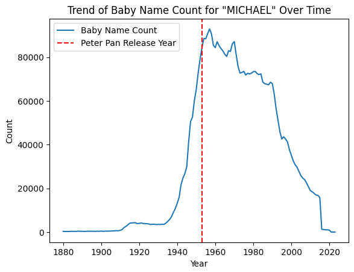

# What a beautiful name! Where does it come from?

## Abstract

Movies and TV content are powerful influencers. Jennifer Aniston's iconic haircut from Friends is one example of a trend that became a cultural phenomenon.

In this project, we explore whether movies influence something as deeply personal as our names.

To investigate, we use a dataset of 81,741 movies, combined with one containing over 450,000 character names, both provided in our course. We connect this data to real-world naming trends using name attribution datasets from various countries. By integrating these datasets, we aim to uncover correlations and patterns, exploring how influential movies each year may have shaped naming trends and whether factors like genre or cultural context drive these changes.

## Research questions

- Can we identify names influenced by the release of blockbuster movies?
- Does the sex of the newborn play a role in these trends?
- Do these trends appear in specific countries? How might the movie's country of origin or the actors' ethnicity impact them?
- Can we observe similar trends with actor names?
- How long-lasting is this influence? Is it a short-term or long-term effect on baby name trends?

## Additional datasets

For our project, we integrated several name attribution datasets from various countries, including:

- United States of America
- France
- United Kingdom
- Norway

You may wonder why our additional datasets mostly come from developed countries. We faced an initial challenge: **the alphabet**. Many countries use scripts other than the Latin alphabet, which complicates the task of managing and processing names consistently. Translating traditional names or finding equivalent representations in the Latin script proved to be a daunting, error-prone task.
Therefore, we opted to limit our analysis to datasets that use the Latin alphabet.

Our second challenge was **data availability from national statistics offices**. Offices in developing countries often prioritize data on critical metrics such as birth mortality rates or education levels—an understandable priority that, unfortunately, restricts the availability of name attribution data.

Since the formats varied widely, we developed a script (names_data.py) to clean and standardize the datasets into a unified structure with these fields:

1. Year
2. Name (in uppercase)
3. Sex [F/M]
4. Count

Additionally, we will extend our datasets by scraping IMDb data to fill missing values.

## Methods

The first method we use is designed to analyze the impact of popular movie character names on baby name trends, revealing shifts in naming patterns after blockbuster movies releases.

- Data Filtering: First we filter the dataset of movies to keep only those with high cultural impact, defined as the top 10 characters from biggest revenue-generating movies per year. Each year’s top movies are identified by grouping the dataset by Release_year and selecting the 10 characters coming from those movies with the highest revenue within each group.

- Character Selection: Once top movies are identified, the character dataset is filtered to include only characters appearing in these selected movies. This filtering creates a refined subset of character names with high public exposure, ready for trend analysis.

- Trend Computation: For each character name in the filtered dataset, we compute the change in baby name popularity around the movie’s release. We do this by calculating the average annual count of babies given the name in the five years before and five years after the release. The difference between these two averages is our trend evalutation.

However, we must take into account that the character name could be influenced by baby name trends and not the other way around. For example, the trend evaluation assessed that the 1953 movie "Peter Pan" was influential and increased the number of babies named "Michael". If we look at the graph, we can see that "Peter-Pan" came out during a "Michael" trend and was thus most likely not so influential on said trend.

We tried another approach to detect unusual trends in name counts following a key date: using Interrupted Time Series (ITS). This approach involves splitting the data, using the pre-date segment to train a model that forecasts expected trends, and then comparing this forecast with the actual post-date data. We’re evaluating two models (Prophet and SARIMA), considering our yearly data limitations.

### name detection

### prophet

## Updated ReadMe
Contribution of Group Members 
- Jeremy : 
    - Names datasets -> cleaning and structuring them in data classes 
    - Name count prediction with Prophet and SARIMA + determining if a name was influenced using the confidence interval.
    - setting up Jekyll to host the website and making carousel shaped as movie film
    - Creating the pipelines to link all of the different parts together
    - Worked on the results.ipynb
- Emile :
    - datasets and naïve approach model presentation
    - "try it yourself" results display
    - Movie influence over time analysis
    - Birth of a new name analysis
- Corentin :
    - Predicted name counts using Prophet and SARIMA models, incorporating confidence intervals and metric computation to determine name influence.
    - Developed the character name recognition system.
    - Contributed to the analysis in results.ipynb.
    - Updated the website to reflect my findings and results.
