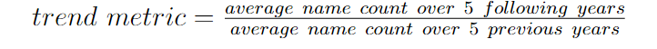

<link rel="stylesheet" href="assets/css/style.css">

# From the *Big Screen* to your everyday life
Movies and TV shows have always been a major influence in our daily, shaping our preceptions, preferences and even cultural norms. From political messages delivered through the narrative to the emergence of new slang expressions, the impact of this medium is powerful and often underrated. Over the years, actors and the characters they played have redefined societal behaviours, starting fashion trends and even ideologies. 

For example, the famous sitcom *Friends* created "The Rachel" phenomenon. In this show, the character played by Jenifer Aniston wore an original haircut that became one of the most requested styles at hair salons across the world. It symbolized a moment where people were identifying as Rachel, were marked by the show and wanted to be just like her. Which is just what we are looking for: media influence !



The case illustrates how a single person's appearance captivated the audience and shaped the tastes of thousands of people, displaying how far the power of storytelling and character design reaches. That effect is what intrigued us for our project and guided us toward its subject.
In this article, we will see how the character names in movies induce trends in baby names, particularly the years immediately following the movie release. 

*option 2 : This case is exactly what captured our curiosity for this project. If a hairstyle can spark a global movement, what about something as personal and enduring as a name? In this article, we dive into the fascinating connection between movies and baby name trends, exploring how characters leave their mark not just on screens, but on birth certificates in the years following their rise to fame.*

# Try it yourself !
But enough talking—now it’s your turn to explore! Ever wondered if your favorite movie left its mark on baby name trends? Enter the name of a film below, and watch as the data unfolds. See for yourself how the power of storytelling might have influenced real-life names !



# Our *datasets* :
To find out how movies influence baby name trends, we worked with 2 datasets. The first one is all about movies. It’s our link to the big screen and helps us track the cultural buzz created by blockbuster hits. The second dataset dives into baby names across four countries: the United States, United Kingdom, France, and Norway. It lets us see how names rise and fall in popularity over time, giving us the some insight to on what’s happening in cinemas to real-world trends. Now, let’s dive into the data !

## The film corpus
First and most important, movies are what inspire people. They tell stories and affect our culture and lifestyle. For example, had you heard of macaws before [Rio](https://en.wikipedia.org/wiki/Rio_(2011_film)) ?

Our dataset contains movies released up to 2014 and informations such as their **unique ID**, **release date**, **genre** and the list of **characters** featured in the work.

In addition to that, we augmented it with [IMDB](https://www.imdb.com) **average rating** and **number of voters** coming from the [IMDB data files](https://datasets.imdbws.com).
We pretreated this dataset to only keep one weighted mean of votes per movie and the number of voters. We created an information 

*option 2:Movies are more than just entertainment, they inspire us, shape our culture, and sometimes even change the way we see the world. Think about it: would you have known about macaws if [Rio](https://en.wikipedia.org/wiki/Rio_(2011_film)) hadn’t brought them to life on screen?*
To explore these connections, our dataset includes a collection of films released up to 2014. It’s packed with details such as:
<ul>
  <li><strong>Movie IDs</strong> to uniquely identify each film.</li>
  <li><strong>Release Dates</strong> to trace when the hype began.</li>
  <li><strong>Genres</strong> to explore trends across action, comedy, drama, and more.</li>
  <li><strong>Character Names</strong> — the stars of our analysis! — to connect the dots between movies and baby name trends.</li>
</ul>

*To make the dataset even more insightful, we added extra details from [IMDB](https://www.imdb.com), including average ratings and the number of votes each movie received. After some preprocessing, we ensured movie has a single weighted rating and vote count.*

### What makes a movie popular ?
Blockbuster movies are far more likely to influence baby name trends than obscure short films from the 1940s. To focus on culturally impactful films, we filtered out less popular ones. This was done by evaluating a movie's popularity using its average IMDb rating and the number of votes it received.

### Genre representation
The genre of a movie is a key indicator of themes and storytelling style of a movie. We will look at its distribution in the dataset.

**NB:** A movie can belong to multiple genres.

Characters in movie genres often follow archetypes, including how they are named. Here are the most common names by genre.

### Important characters
Some characters retain the attention of spectators whereas others will be forgotten after a day. To account for this disparity and for simplicity, we decided to keep only the most important characters in every movie in the dataset. 

In order to measure character importance, we count the number of citation of their name in the summary of the movie and keep the most mentioned ones.

**A VENIR : exemple avec les 2-3 persos d'un film connu, fourni par Coco**

## The baby names collection
Even if it remains a simple word, your name is what you are referred as for your entire life. It represents your whole identity and often mirrors cultural trends, family traditions or historical events.

We used a dataset consisting of baby names each year for the United States, United Kingdom, France and Norway to acccount for name trends.
### Most given names in the dataset

# Processes

Now that we have all this data, the next step is leveraging it to create insights into the influence of movies on baby names. How can we analyze and interpret this information to better understand this cultural impact of cinema ?
## The naïve approach
At first, we developped a naïve model that compared the popularity of a name five years before and after a movie's release. By dividing the average number of times the name is given per year before and after the movie, we get a trend metric that assesses the film's impact. 

Unfortunately, this is not so simple. This model doesn't account for the inverse effect, i.e. the name trend influencing the filmmakers for the name of their characters. 

To illustrate this, let's take the example of [Michael from Peter Pan](https://disney.fandom.com/wiki/Michael_Darling). According to our model, the 1953 film Peter Pan had a great impact on people naming their child Michael. Let's look at the trend graph : 



It is clear that the film was released during a peak of popularity for the name Michael, and therefore most likely didn't play a role in its usage.

## Using Machine Learning predicitions
blabla

# Results
Using this method, we can generate a list of films that have influenced the general trend for first names. Now that we produced our results, let's take a look at them. 

## Movie influence over time
One might come to the idea that cultural and cinematic impact fluctuates over time. Here are the number of names influenced by movie characters over decades from the 60s to the 00s.



#### Several observations :
A steady growth is observed in the 60s and 70s, corresponding to the late stage of the [Golden Age of Hollywood](https://en.wikipedia.org/wiki/Classical_Hollywood_cinema#1927–1960:_Sound_era_and_the_Golden_Age_of_Hollywood). This period marks the rise of popular movies and the increase in revenue the cinema industry generates.

The 80s exhibit a significant increase, influencing over a **hundred** names. With the release of iconic movies such as [Alien](https://en.wikipedia.org/wiki/Alien_(film)), 
[E.T.](https://en.wikipedia.org/wiki/E.T._the_Extra-Terrestrial) and the first three [Indiana Jones](https://en.wikipedia.org/wiki/Indiana_Jones) movies, this era represents the start of the Blockbuster age, giving Hollywood a worldwide reach and a foothold on Pop Culture icons.

Cinema reached its peak influence over baby names in the 90s. This apogee can be linked with the [Disney Renaissance](https://en.wikipedia.org/wiki/Disney_Renaissance) period and the emergence of globally beloved characters accross various animated and live-action films. During this era, cinema was the main medium for conveying stories and entertaining the people.

Y2K brings a noticeable decline in influenced names, dropping back to similar levels as the 70s despite having a much more developped industry. This indicates a shift in cultural trends, where people turn to the rising internet and streaming services, giving less attention to feature-length films. This period reflects the fragmentation of media influence and the appearance of new ways of telling stories.

# Birth of a new name
Some films have such a cultural impact that they leave a lasting impression on the audience with their characters and make them remember their name, even when they don't even exist or are practically unused. These events lead to the resurgence of an unpopular name or even the creation of a new one.



# Test 2 colonnes de texte

  

    
Text a gauche lorem fidsfjiji j idfisi ii ii ifii ii fi i ifjwionfnenfo nn nef iewi omeiofm owmefiom io

  

  

    
Paragraph on the right for additional content or details.

  

# Is there a movie genre that has a stronger influence on names ?
Does an adventurous film, where the hero embodies all the traits we aspire to—bravery, charisma, and triumph—leave a stronger mark than a heart-wrenching drama? Or is it the tension and excitement of a thriller that makes a name stick in our minds?

In this part, we set out to explore which movie genres resonate the most, in other words, whether certain movie genres have a stronger influence on baby names than others. 
To measure this, we used the difference-mean metric—a score that represents the gap between a name’s real trend curve after a movie’s release and its predicted curve if the movie had never existed. Simply put, the higher the score, the greater the movie’s impact on that name.
The results are clear: Action, Thriller, and Drama stand out as the most influential genres. These types of movies, often featuring intense storytelling and memorable characters, seem to leave a stronger mark on audiences. The treemap confirms this, highlighting names like Ethan and Emma that dominate multiple categories, particularly in high-stakes genres like Action and Thriller.



This treemap is a representation of the amplitude of the influence of movie genre:



this other treemap shows the most influent genre and the top 3 names for each of them, in term  propotion.
{ %include treemap_top3_by_genre_by_count.html %}

While we might expect romantic films or period pieces to lead the charge, it’s the fast-paced, emotionally gripping genres that truly shape naming trends. It’s as if the excitement and tension of these stories spill over into real life, inspiring parents to choose names that reflect the bold and impactful characters they’ve seen on screen.

# Are women names more influenced than men's ?

# Bibliography
1. [Wikipedia: The Rachel](https://en.wikipedia.org/wiki/The_Rachel)
2. [Rachel's Picture](https://tierneysalons.com/wp-content/uploads/2023/12/0e461a848663146e13e5444687934cb0.jpg)
3. [Article on "The Rachel" by InStyle](https://www.instyle.com/the-rachel-haircut-8575551)
4. [Header Background Picture](https://imgur.com/photo-103bn-photo-116-hollywood-stars-including-leonardo-di-caprio-steven-spielberg-tom-cruise-robert-downey-jr-jack-nicholson-sean-penn-brad-pitt-martin-scorsese-dustin-hoffman-meryl-streep-jj-abrams-barbra-streisand-more-pose-toge-w1z5c) 

